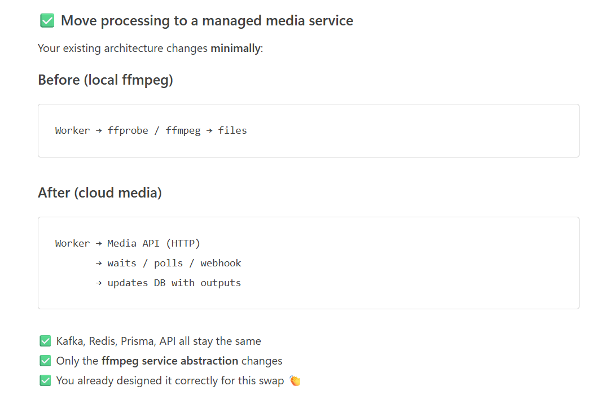

# Video-Processing-and-Streaming-pipeline
Video Processing and Streaming pipeline - using tech stack like postgres, redis Bull, Kafka, NextJS and NestJS

npm install -g @nestjs/cli

npm run build --workspace packages/shared

npm exec prisma generate --workspace apps/api

npm exec prisma generate --workspace apps/worker 
npm exec prisma generate --workspace apps/worker --schema=../api/src/infra/db/prisma/schema.prisma

/videos/:id
/videos/:id/play
/videos/:id/manifest
/videos/:id/thumbnails

✅ What you can test without a UI
Using Postman + logs + filesystem + DB, you can verify:

✅ Video upload endpoint
✅ File streaming to disk
✅ Kafka video.uploaded event emission
✅ Worker consumption
✅ Redis idempotency
✅ ffmpeg execution
✅ Metadata extraction
✅ Renditions persisted in DB

That’s the entire system.

 docker run -it --rm confluentinc/cp-kafka kafka-storage random-uuid

npm run start:dev --workspace apps/api
npm run start:dev --workspace apps/worker

# Build process
docker compose build
docker compose up
docker compose up --build
docker compose up -d
# all services
docker compose logs -f

# specific service
docker compose logs -f api
docker compose logs -f worker
docker compose ps
# API
curl http://localhost:3000/health

# Web
curl http://localhost:3001
# stop but keep volumes
docker compose down

# stop AND wipe postgres data (clean slate retest)
docker compose down -v

# remove all stopped containers, dangling images, build cache
docker system prune -af

# check how much space you have now
docker system df

# check env varibales used
grep -r "process\.env\." apps/api/src apps/worker/src | grep -v node_modules | grep -oE 'process\.env\.[A-Z_]+' | sort -u

Actually free: Minikube on Oracle Cloud ARM VM

Oracle VM is free forever (4 cores, 24GB RAM)
Run Minikube on it
Real public IP
Full k8s experience
This is what I'd recommend

You get:

Real Kubernetes (not local toy)
Public URL
Free forever
Enough resources to run your full stack

The plan:

Oracle Cloud ARM VM (free)
Install Minikube + kubectl on it
Write k8s manifests for your services
Set up GitHub Actions CI/CD
Point a domain at it (optional)

Your k8s manifests will need:

Deployment + Service for api, worker, web
Job for migrate
StatefulSet for postgres, kafka, redis
PersistentVolumeClaim for shared uploads/processed volumes
ConfigMap + Secret for env vars

docker login
docker compose build
docker compose push

Step 2 — Sign up for Oracle Cloud
Go to cloud.oracle.com, create account. Use a real credit card (won't be charged). During VM creation choose:

Shape: Ampere A1 (ARM, free)
OCPU: 4, RAM: 24GB
OS: Ubuntu 22.04
Add your SSH public key

Step 3 — Come back here
Once you have the VM's public IP and can SSH into it, I'll walk you through:

Installing Docker, kubectl, Minikube
Writing all k8s manifests
Setting up GitHub Actions

On Minikube you'll need to enable the addon:
bashminikube addons enable volumesnapshots
minikube addons enable csi-hostpath-driver
Then patch the hostpath storage class to support ReadWriteMany:
bashkubectl patch storageclass csi-hostpath-sc -p '{"metadata": {"annotations":{"storageclass.kubernetes.io/is-default-class":"true"}}}'